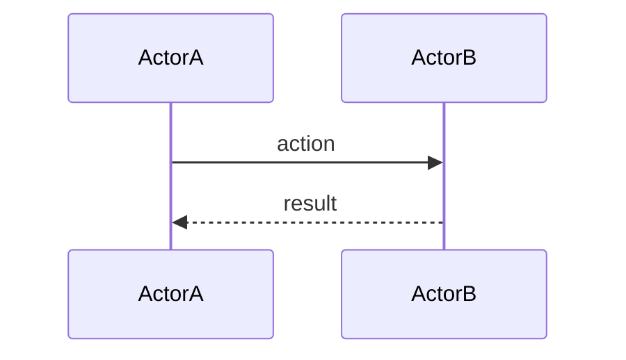
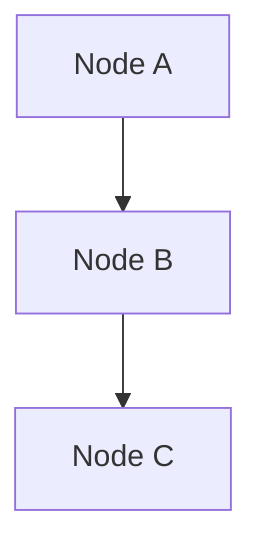

# Lesson: [Descriptive Topic Title]

*YYYY-MM-DD — one-line summary of what this lesson covers*

---

## Chapter 1: [Name the concept — not just "Background"]

[Prose. Explain the situation before the decision. Present tense, authoritative.
No bullet lists in content chapters — this is writing, not a list.
Opening sentence: why before what. Each chapter flows into the next.]

---

## Chapter 2: [The key concept, framework, or decision]

[Explain the thing. Use code blocks for code or config. Use tables for comparisons.
Every code snippet must come from actual source files — do not invent them.]

```csharp
// example code block
```

---

## Chapter 3: [How it was applied / the design]

---

## Chapter 4: [Tradeoffs, cost, constraints, or measurement]

---

## Chapter N: What We Learned

[THIS IS THE ONLY CHAPTER THAT USES BULLET POINTS.]

- Each bullet is one complete sentence.
- Focus on transferable insight: "X matters because Y" not just "X is true."
- Aim for 5–10 bullets.

---

## What Comes Next

[Numbered list — immediate next steps only, not the full roadmap.]

1. Step one.
2. Step two.

---

## Research References

[Optional. Include when papers, frameworks, or external sources informed decisions in this lesson.]

Author, A. (YYYY). Title. *Venue*. One sentence on relevance.

---

## Sequence Interaction Diagram

[REQUIRED in every lesson. Models runtime or process flow — who calls what, in what order.
Use participant names that match real names in the code or process.]



## Concept Diagram

[REQUIRED in every lesson. Models structural relationships between concepts, files, or components.]



---

**Naming convention:** `lessons/YYYY-MM-DD_kebab-topic.md`
**Location:** `WindowConfigurator/lessons/`
**Register in:** `lessons/LESSON_CATALOG.md`
**Skill instructions:** `skills/create-lesson-core.md`
