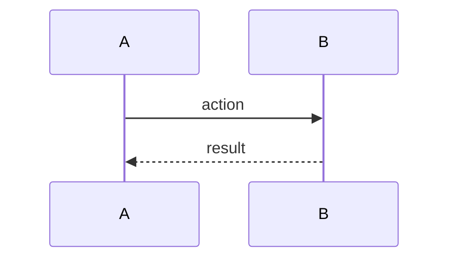
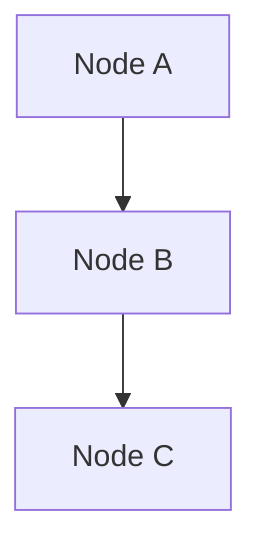

# Lesson: [Topic Title]

*[YYYY-MM-DD] — [one-line summary of what this lesson covers]*

---

## Chapter 1: [Why this decision / context / problem]

[Prose. Explain the situation before the decision. Present tense, authoritative.
No bullets — this is writing, not a list. Each chapter flows into the next.]

---

## Chapter 2: [The key concept or framework]

[Explain the thing. Use code blocks for code or config. Tables where comparison helps.]

---

## Chapter 3: [How it was applied / the design]

---

## Chapter 4: [What it costs / tradeoffs / constraints]

---

## Chapter N: What We Learned

[Bullet list — this is the only chapter that uses bullets.]

- Point one.
- Point two.
- Point three.

---

## What Comes Next

[Numbered list of immediate next steps.]

1. Step one.
2. Step two.

---

## Research References

[Optional. Papers, ADRs, or external resources that ground the claims in this lesson.]

---

## Sequence Interaction Diagram

## Concept Diagram

---

**Naming convention:** `lesson_YYYY-MM-DD_kebab-topic.md`
**Location:** `WindowConfigurator/lessons/`
**Register in:** `LESSON_CATALOG.md`
