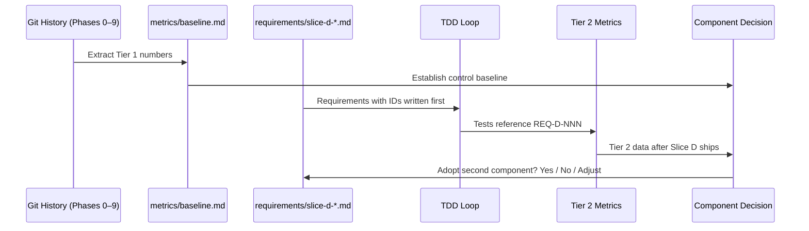
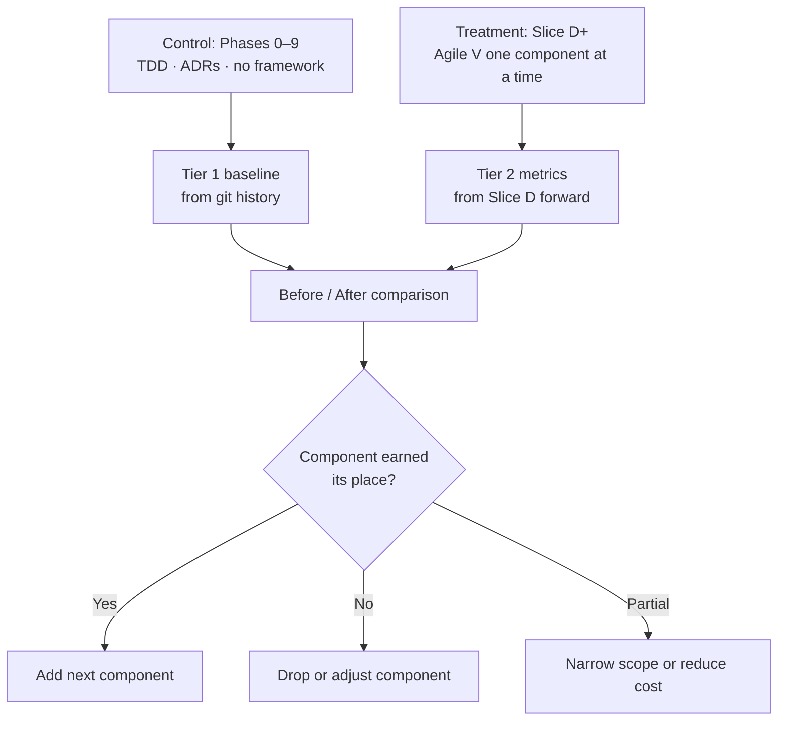

# Lesson: The Experiment Begins

*2026-06-11 — Strategic pivot, Agile V adoption design, quality metric framework*

---

## Chapter 1: Why the Repository Changed Shape Tonight

WindowConfigurator began as a product. It is still a product — it will run in production, people will use it, and the pricing model is real. But tonight it became something else as well: a controlled experiment.

The difference is in what gets measured. A product development project measures shipping — features complete, tests passing, the thing works. An experiment measures cause and effect — did this intervention produce that outcome, and what did it cost?

Dorian is transitioning to AI engineering contracting. The pitch is not "I built a thing" — it is "I know how to run agentic development carefully, and I can prove it." That proof requires data. It requires a before, an after, and a methodology for comparing them.

WindowConfigurator is uniquely suited for this because it has a pre-existing history. Phases 0 through 9 were built without any formal SDLC framework beyond TDD and ADRs. Phase 10, starting with Slice D, will be built differently — one new discipline introduced at a time, each one justified before the next is added. The git history is the control group. The new work is the treatment.

---

## Chapter 2: The Agile V Framework

Agile V (arXiv:2602.20684, github.com/Agile-V/agile_v_skills) is an AI-era development framework that merges Agile iteration with the V-Model's verification discipline. It is designed for compliance-ready, auditable systems where a human must be able to trace every requirement through to its evidence of satisfaction.

Three pillars define it:

**Traceability** means every requirement has an ID, and that ID appears in the test that verifies it and the code that implements it. When something breaks in production, you can answer "which requirement was violated and which test should have caught it?" without searching for clues.

**Verification** means that before any slice merges, an independent agent challenges the implementation against the requirements. Not the same agent that built it. Not the author's own tests. A separate pass whose job is to find gaps.

**Human Curation** means a human approves each requirement before work begins and reviews the verification report before the merge. The human is not optional. The framework is not a replacement for judgment — it is a structure that makes judgment auditable.

The adoption strategy for this repository is deliberate: one component at a time. Each component must demonstrate measurable value relative to its token cost before the next component is added. This is not timidity — it is the methodology itself on display.

---

## Chapter 3: Designing the Experiment

The experiment has one primary question: *does each Agile V component produce measurable quality improvement relative to its token cost?*

That question requires a control baseline, a treatment group, and measurement instruments.

**The control baseline is Phases 0–9.** These phases were built with TDD, ADRs, journal entries, and PR gates. No formal requirements documentation. No traceability matrix. No independent verification pass. The baseline quality is what you get from disciplined but framework-free agentic development.

**The treatment group begins at Slice D.** Starting with the first Agile V component (requirements with IDs), each slice will have at least one more Agile V element than the previous one. The experiment runs forward from here.

**The baseline asymmetry:** quality metrics are reconstructible from git history — the data is already there in commit messages, test counts, ADR counts, and journal entries. Token cost data is not. There was no token measurement in Phases 0–9. This means the experiment's quality before/after can span the full project history, but the token cost before/after can only start at Slice D. The methodology accepts this constraint explicitly.

---

## Chapter 4: Quality Metrics — Three Tiers

Not all quality signals are equally easy to collect. The metrics are organised by what they require.

**Tier 1 — Extractable from git history today.** These define the baseline.

| Metric | What it measures | Source |
|---|---|---|
| Test count per phase | Growth of verification coverage | Journal entries, test discovery |
| ADR count per phase | Architecture decision density | `git log -- adr/` |
| Fix commit ratio | Rework rate — commits that fix rather than advance | Commit message prefix analysis |
| Commit count per slice | Complexity proxy — more commits means more iteration | `git log --oneline` |
| Documentation artifact count | Docs density relative to code volume | File count: ADRs, journals, handoffs |

**Tier 2 — Starts at Slice D.** These require deliberate instrumentation going forward.

| Metric | What it measures |
|---|---|
| Requirement count per slice | Scope formalisation level |
| Requirement coverage % | Fraction of requirements with a passing test |
| Estimated session token load | Token cost of each Agile V component |
| Agile V step adherence | Did the slice follow the prescribed order? |

**Tier 3 — Future.** Scope drift rate, Red Team Verifier finding rate, cost-to-quality ratio. Not measured until tooling exists to collect them reliably.

The immediate priority before Slice D begins is pulling Tier 1 numbers from git history and recording them in `metrics/baseline.md`.

---

## Chapter 5: The First Component — Requirements with IDs

The first Agile V component to be adopted is formal requirements documentation with stable identifiers.

Before any code or tests are written for Slice D, a document at `requirements/slice-d-demo-ux-hardening.md` will be created. Each entry is a numbered requirement — `REQ-D-001`, `REQ-D-002`, and so on. Each requirement is one sentence, testable, and scoped to the slice. Anything that cannot be tested is not a requirement.

This component was chosen first for three reasons.

First, it is the spine onto which every other Agile V component attaches. Traceability requires requirement IDs. Verification checks against requirement IDs. Without them, the other pillars have nothing to connect to.

Second, its token overhead is low. A requirements document for a slice of this scope runs roughly 300–500 tokens of context per session. The value-to-cost ratio is therefore as favorable as it will ever be.

Third, it changes the instruction to the agent from "here is the task" to "here are the requirements, now derive the task." That shift has already been identified in the Agile V literature as the single biggest contributor to reduced scope drift.

Nothing else from the Agile V framework is adopted in Slice D. Just requirements with IDs. After Slice D ships, the Tier 2 metrics are reviewed. That result — whatever it is — guides the decision about the second component.

---

## Chapter 6: Token Frugality Is a First-Class Concern

Every Agile V component costs tokens: context loaded at session start, additional planning steps, verification passes. If the token cost exceeds the value produced, the component should not be adopted. This is the empirical core of the methodology.

The measurement strategy is simple: before each session, record the intent and estimated scope. After the session, record the estimated token load. Over time, a pattern emerges — which components consistently pay for themselves, and which produce diminishing returns as slice scope shrinks.

This is also article content. The token frugality methodology is Dorian's key intellectual contribution to the contracting pitch. WindowConfigurator is generating the empirical evidence for that methodology in real time.

Model tiering follows from the data: formulaic tasks (ADR formatting, test scaffolding from an existing pattern, documentation cross-referencing) are candidates for a smaller model once enough sessions confirm their pattern. Architectural reasoning, requirements analysis, and Red Team verification require the full model. The tiering policy will be derived from measurement data, not intuition.

---

## Chapter 7: What We Learned

- WindowConfigurator is now both a product and a controlled experiment. The experiment runs inside a production-aligned codebase so the results are meaningful.
- Agile V provides the experimental treatment — three pillars adopted one component at a time, each justified before the next.
- The baseline is reconstructible from git history (Phases 0–9). Token cost baseline starts at Slice D. Accept this asymmetry explicitly.
- Quality metrics are organised in three tiers by what they require. Tier 1 is readable from git history today. Tier 2 starts at Slice D. Tier 3 waits for tooling.
- The first component is requirements with IDs: low token overhead, maximum structural leverage.
- Token frugality is a first-class measurement target and the methodology being demonstrated to the market.

---

## What Comes Next

1. Pull Tier 1 baseline numbers from git history into `metrics/baseline.md`.
2. Merge PR #3 (Dorian) and push main.
3. Create the Slice D branch.
4. Write `requirements/slice-d-demo-ux-hardening.md` before touching any code.
5. Proceed with TDD as normal — test names reference requirement IDs where natural.

The second Agile V component will not be chosen until Slice D is complete and the Tier 2 metrics are reviewed.

---

## Research References

Papers that support the quality metric framework in Chapter 4.

**Fix commit ratio as a rework signal:**
Śliwerski, J., Zimmermann, T., & Zeller, A. (2005). When do changes induce fixes? *Proceedings of the 2005 International Workshop on Mining Software Repositories (MSR 2005)*. The foundational empirical paper for identifying bug-fixing commits by message pattern. Shows that change-inducing commits are predictable and concentrated around identifiable change clusters.

**Code churn and defect density:**
Nagappan, N., & Ball, T. (2005). Use of relative code churn measures to predict system defect density. *ICSE 2005*. Establishes that churn metrics (lines changed per interval, edit frequency) are stronger defect predictors than static complexity metrics in real-world codebases. Basis for using commit count as a complexity proxy.

**Change classification — clean vs buggy:**
Kim, S., Whitehead, E. J., & Zhang, Y. (2008). Classifying software changes: Clean or buggy? *IEEE Transactions on Software Engineering, 34*(2). Extends Śliwerski et al. with classification methods; explains what commit message patterns most reliably separate rework from forward progress. Useful for operationalising fix commit ratio.

**Documentation and software engineering practice:**
Lethbridge, T. C., Singer, J., & Forward, A. (2003). How software engineers use documentation: The state of the practice. *IEEE Software, 20*(6), 35–39. Empirical survey establishing documentation density as a proxy for knowledge transfer quality, not just compliance. Motivates ADR and journal counting as quality indicators.

**Agile V framework:**
Rashid, A., et al. (2025/2026). Agile V: A compliance-ready framework for AI-era software development. *arXiv:2602.20684*. The framework being adopted in this experiment. GitHub: github.com/Agile-V/agile_v_skills.

---

## Sequence Interaction Diagram

## Concept Diagram

