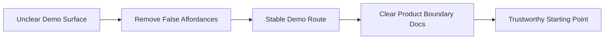

# Phase 0 Lesson: Stabilize The Demo Surface

## Why This Phase Exists

Before architecture, we need honesty. A demo that implies nonexistent behavior is technical debt with good lighting.

## Build Steps We Completed

1. Removed or hid unsupported UI affordances (fake create/save/delete style flows).
2. Kept a stable, predictable entry route for demos.
3. Reframed language from order-management semantics to configurator/session semantics.
4. Documented boundaries so contributors know what is real vs placeholder.

## Core Idea Diagram



## Representative Snippet

`Program.cs` establishes explicit routes, including a deterministic dev-session bootstrap path:

```csharp
app.MapControllerRoute(
    name: "default",
    pattern: "{id?}",
    defaults: new { controller = "orderitem", action = "index"});

app.MapControllerRoute(
    name: "createSession",
    pattern: "new",
    defaults: new { controller = "orderitem", action = "CreateDevSession"});
```

## What To Teach In A Video

- "Delete illusion first, then optimize reality."
- Why stable entry points reduce debugging noise.
- Why language precision ("quote session" vs "order") is architecture, not branding.
