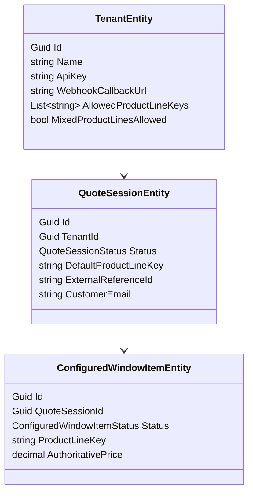

# Phase 1 Lesson: Define The Real Backend Shape

## Why This Phase Exists

If the nouns are wrong, every verb becomes expensive. We replaced a misleading order-centric mental model with a session-centric one.

## Build Steps We Completed

1. Defined `Tenant`, `QuoteSession`, and `ConfiguredWindowItem`.
2. Defined status lifecycles for session and item.
3. Clarified where product line defaults live.
4. Documented the shape in ADRs and roadmap.

## Domain Diagram



## Representative Snippet

```csharp
public class QuoteSessionEntity
{
    public Guid Id { get; set; } = Guid.NewGuid();
    public Guid TenantId { get; set; }
    public QuoteSessionStatus Status { get; set; } = QuoteSessionStatus.Draft;
    public string? DefaultProductLineKey { get; set; }
    public string? CustomerEmail { get; set; }
    public string? ExternalReferenceId { get; set; }
    public List<ConfiguredWindowItemEntity> Items { get; set; } = new();
}
```

## What To Teach In A Video

- Why "quote session" matches pre-order reality.
- Why status transitions are a contract, not just enum values.
- How ADR 0003 makes future refactors cheaper.
