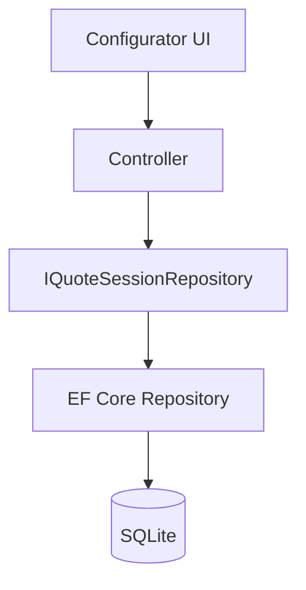

# Phase 2 Lesson: Introduce Session Persistence

## Why This Phase Exists

A configurator without persistence is a demo. A configurator with persistence is a product candidate.

## Build Steps We Completed

1. Added EF Core DbContext and SQLite persistence.
2. Persisted tenants, sessions, and configured items.
3. Added repository interfaces and EF implementations.
4. Added integration-style tests using SQLite in-memory.

## Persistence Diagram



## Representative Snippets

DbContext surface:

```csharp
public DbSet<TenantEntity> Tenants => Set<TenantEntity>();
public DbSet<QuoteSessionEntity> QuoteSessions => Set<QuoteSessionEntity>();
public DbSet<ConfiguredWindowItemEntity> ConfiguredWindowItems => Set<ConfiguredWindowItemEntity>();
```

Repository shape:

```csharp
public interface IQuoteSessionRepository
{
    Task<QuoteSessionEntity?> GetByIdAsync(Guid id);
    Task AddAsync(QuoteSessionEntity session);
    Task AddItemAsync(Guid sessionId, ConfiguredWindowItemEntity item);
    Task SaveChangesAsync();
}
```

## What To Teach In A Video

- Why SQLite in-memory catches real query behavior that fake providers miss.
- Why storing full JSON snapshots plus promoted scalars is a pragmatic early schema.
