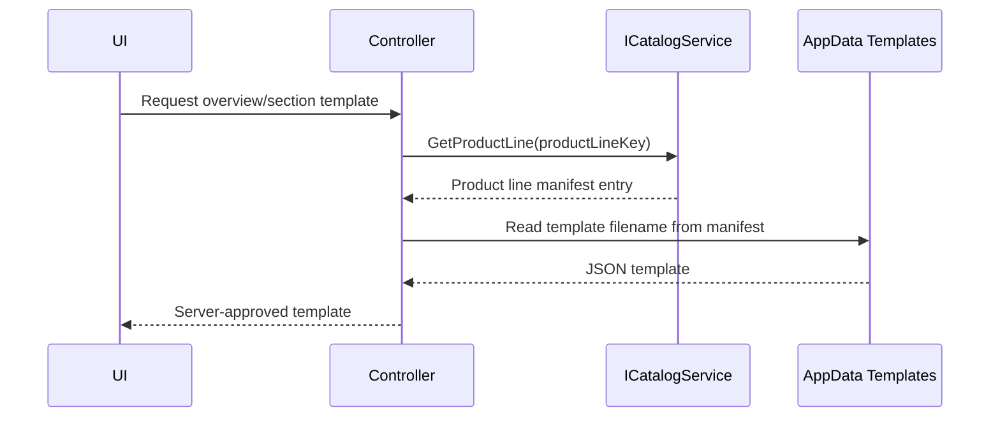

# Phase 3 Lesson: Move Catalog Resolution Behind The Server

## Why This Phase Exists

If the client chooses catalog files freely, pricing and validation are theater. The server must own what is selectable.

## Build Steps We Completed

1. Added catalog service abstraction (`ICatalogService`).
2. Keyed catalog lookup by product line context.
3. Updated controller behavior to resolve templates server-side.
4. Enforced tenant product-line access constraints.

## Resolution Diagram



## Representative Snippet

```csharp
var productLineKey = session.Items.FirstOrDefault()?.ProductLineKey
    ?? session.DefaultProductLineKey;

var catalogEntry = productLineKey != null ? _catalog.GetProductLine(productLineKey) : null;
var templateFile = catalogEntry?.ItemTemplateFile ?? "energySaverItemTemplate.json";

var json = await _templateReader.ReadTemplateAsync(templateFile);
return Ok(json);
```

## What To Teach In A Video

- Why "server chooses files" is a security and correctness boundary.
- How catalog manifest indirection supports tenant policies.
