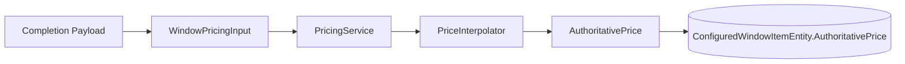

# Phase 4 Lesson: Port Authoritative Pricing To The Server

## Why This Phase Exists

The client can estimate. The server must decide.

## Build Steps We Completed

1. Ported JavaScript pricing logic to C# (`PricingService`).
2. Loaded shared pricing data (`priceInfo.json`) server-side.
3. Priced completion payloads server-side and persisted authoritative item prices.
4. Added cross-validation tests against legacy JavaScript behavior.

## Pricing Flow Diagram



## Representative Snippet

```csharp
decimal authoritativePrice;
try
{
    authoritativePrice = _pricingService.CalculatePrice(pricingInput);
}
catch (ArgumentException ex)
{
    return BadRequest(ex.Message);
}
```

## Critical Regression Story

We fixed a real parity bug where brickmould pricing in C# used `frameWidth/frameHeight` instead of top-level payload `width/height` for a sizing mode. That created a visible estimate/authoritative mismatch.

## What To Teach In A Video

- How to preserve parity while porting engines across languages.
- Why authoritative price must be persisted as a first-class field.
