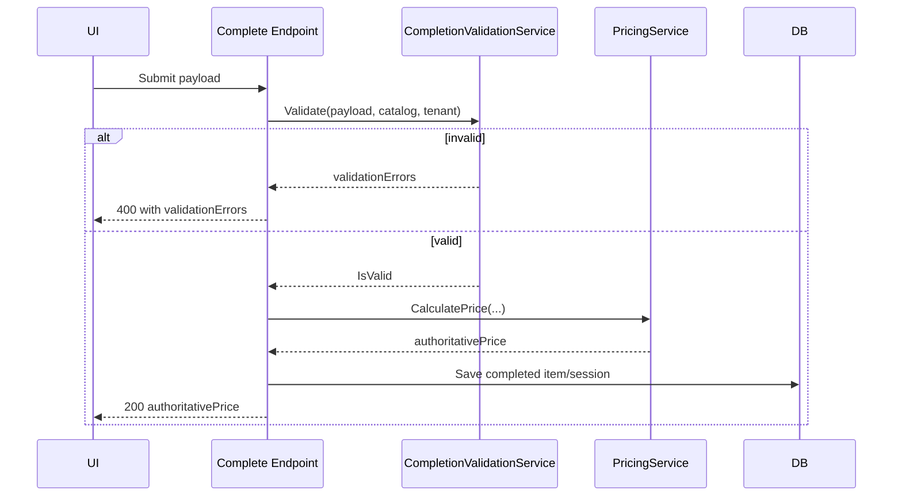

# Phase 5 Lesson: Add Server-Side Validation At Completion

## Why This Phase Exists

Client-side validation is UX. Server-side validation is policy.

## Build Steps We Completed

1. Added `CompletionValidationService`.
2. Validated frame/style/section constraints and option compatibility.
3. Enforced tenant product-line policies at completion.
4. Added pricing-grid support checks and runtime grid alignment.
5. Standardized completion error payloads consumable by UI.

## Validation Boundary Diagram



## Representative Snippet

```csharp
var validation = _completionValidation.Validate(payload, productLineKey, tenant, itemTemplateJson);
if (!validation.IsValid)
    return BadRequest(new { validationErrors = validation.Errors });
```

## Key Engineering Move

`PricingGridAligner` extends in-memory pricing breakpoints to catalog maxima at startup, so "catalog-valid" dimensions don't fail at pricing-grid edges.

## What To Teach In A Video

- Why validation and pricing should share one authoritative catalog context.
- How regression matrices prevent quiet parity drift.
