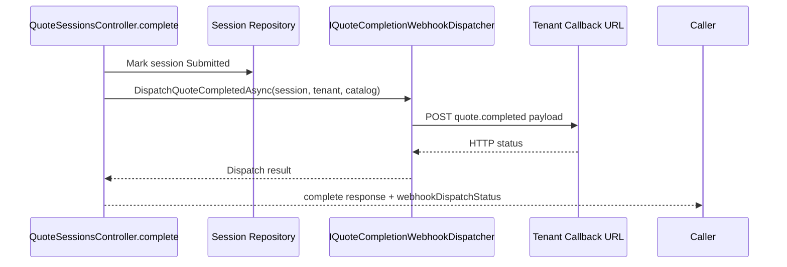

# Phase 7 Kickoff Lesson: Webhook Dispatch On Submit

## Why This Slice Exists

A submitted session that never leaves the system is not integrated. This slice wires real outbound delivery into submit.

## Build Steps We Completed

1. Added `IQuoteCompletionWebhookDispatcher`.
2. Implemented `QuoteCompletionWebhookDispatcher` with `HttpClient`.
3. Built `QuoteCompletedPayload` from session + items + catalog metadata.
4. Called dispatcher from `POST /api/v1/quote-sessions/{id}/complete`.
5. Returned dispatch attempt status metadata in completion response.
6. Added dispatcher unit tests and controller integration-style tests.

## Dispatch Diagram



## Representative Snippets

Dispatcher registration:

```csharp
builder.Services.AddHttpClient<IQuoteCompletionWebhookDispatcher, QuoteCompletionWebhookDispatcher>();
```

Submit response metadata:

```csharp
return Ok(new CompleteQuoteSessionResponse
{
    SessionId = session.Id,
    Status = session.Status.ToString(),
    WebhookDispatchStatus = dispatch.Succeeded ? "delivered" : "failed",
    WebhookStatusCode = dispatch.StatusCode,
    WebhookError = dispatch.Error
});
```

## What Comes Next

- Durable delivery logging
- Retry/backoff policy
- Failure recovery workflow

## What To Teach In A Video

- Why submission and delivery are related but distinct state machines.
- Why this interface seam makes retries and observability easy to add next.
