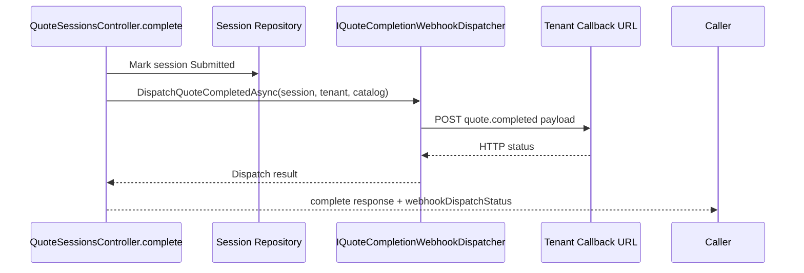
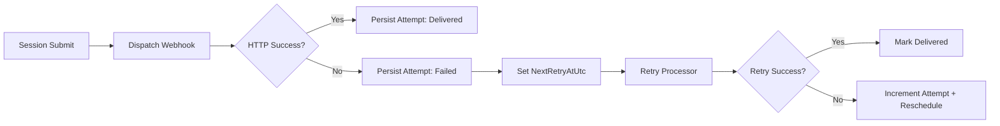

# Phase 7 Kickoff Lesson: Webhook Dispatch On Submit

## Why This Slice Exists

A submitted session that never leaves the system is not integrated. This slice wires real outbound delivery into submit.

## Build Steps We Completed

1. Added `IQuoteCompletionWebhookDispatcher`.
2. Implemented `QuoteCompletionWebhookDispatcher` with `HttpClient`.
3. Built `QuoteCompletedPayload` from session + items + catalog metadata.
4. Called dispatcher from `POST /api/v1/quote-sessions/{id}/complete`.
5. Returned dispatch attempt status metadata in completion response.
6. Added dispatcher unit tests and controller integration-style tests.
7. Added durable webhook delivery-attempt persistence with first retry metadata (`NextRetryAtUtc`).
8. Added retry execution service for due failed attempts (`IWebhookRetryProcessor`).
9. Added tenant integration settings API for callback URL management.

## Dispatch Diagram



## Representative Snippets

Dispatcher registration:

```csharp
builder.Services.AddHttpClient<IQuoteCompletionWebhookDispatcher, QuoteCompletionWebhookDispatcher>();
```

Submit response metadata:

```csharp
return Ok(new CompleteQuoteSessionResponse
{
    SessionId = session.Id,
    Status = session.Status.ToString(),
    WebhookDispatchStatus = dispatch.Succeeded ? "delivered" : "failed",
    WebhookStatusCode = dispatch.StatusCode,
    WebhookError = dispatch.Error
});
```

## How Testing Works (And What Is Mocked)

We are **not** calling a real CRM in tests yet.

We test webhook behavior at two levels:

1. **Controller level** (`QuoteSessionsControllerTests`)
   - uses a fake `IQuoteCompletionWebhookDispatcher`
   - verifies that submit calls dispatch and persists delivery-attempt records
   - verifies success/failure state mapping in API responses

2. **Dispatcher level** (`QuoteCompletionWebhookDispatcherTests`)
   - uses a custom fake `HttpMessageHandler` injected into `HttpClient`
   - captures the outgoing JSON body and returns controlled HTTP status codes
   - verifies payload event type and success/failure handling without network calls

Example fake HTTP handler pattern:

```csharp
private class RecordingHandler : HttpMessageHandler
{
    protected override Task<HttpResponseMessage> SendAsync(HttpRequestMessage request, CancellationToken ct)
    {
        // Capture request.Content here for assertions.
        return Task.FromResult(new HttpResponseMessage(HttpStatusCode.OK));
    }
}
```

What we still do **not** have:
- full end-to-end test against a running external webhook receiver process
- operational retry worker hosting tests (service loop/lifecycle)

## What Comes Next

- Background retry worker orchestration
- Delivery observability/reporting surfaces
- Full tenant/auth hardening

## Durable Attempt Tracking Diagram



## What To Teach In A Video

- Why submission and delivery are related but distinct state machines.
- Why this interface seam makes retries and observability easy to add next.
