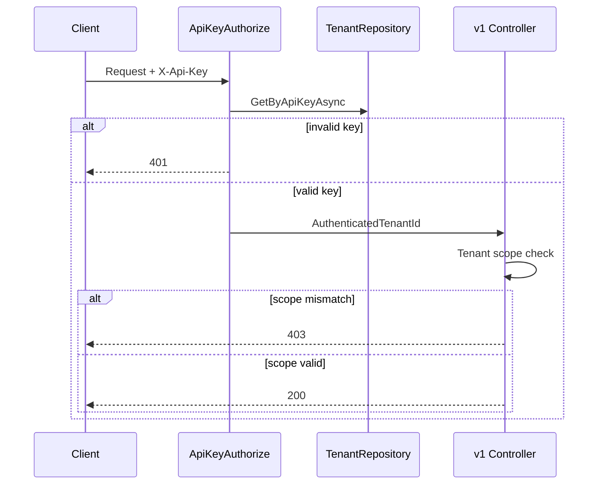
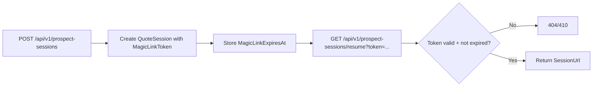

# Phase 8 Lesson: Multi-Tenant Hardening

## Why This Phase Exists

A multi-tenant system is only real when tenant boundaries are explicit and enforced, not implied.

## Build Steps We Completed

1. Added API-key authorization for `/api/v1/*` with tenant resolution.
2. Enforced tenant scope checks (`401` missing/invalid key, `403` scope mismatch).
3. Added tenant policy/branding API (`/api/v1/tenants/{id}/policy`).
4. Added tenant integration settings API (`/api/v1/tenants/{id}/integration`).
5. Added prospect start/resume flow with magic-link token expiry checks.
6. Added retry-capable webhook delivery processing over persisted failed attempts.

## Security Diagram



## Representative Snippet

```csharp
if (!HttpContext.Items.TryGetValue(ApiKeyAuthorizeFilter.TenantIdItemKey, out var raw) || raw is not Guid tenantId)
    return Unauthorized(...);

if (session.TenantId != tenantId)
    return StatusCode(StatusCodes.Status403Forbidden, ...);
```

## Prospect Resume Diagram



## What To Teach In A Video

- Why auth and scope are separate checks.
- Why tenant policy APIs matter for operational self-service.
- Why token start/resume can be built before email transport infrastructure.

## Testing Notes For External Integrations

For this phase, we test integration edges with **test doubles**, not real external systems:

- API-key auth is tested with filter/controller tests by setting request context and headers.
- webhook retry behavior is tested with a fake dispatcher returning controlled results.
- prospect resume tests use real DB state (SQLite in-memory) with generated/expired tokens.

This gives deterministic coverage of our boundary logic while keeping tests fast and repeatable.
