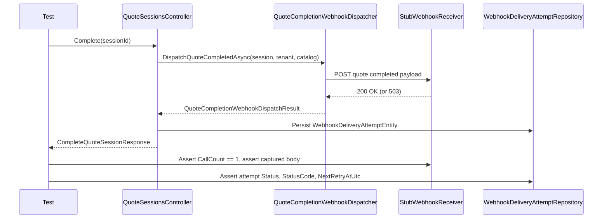
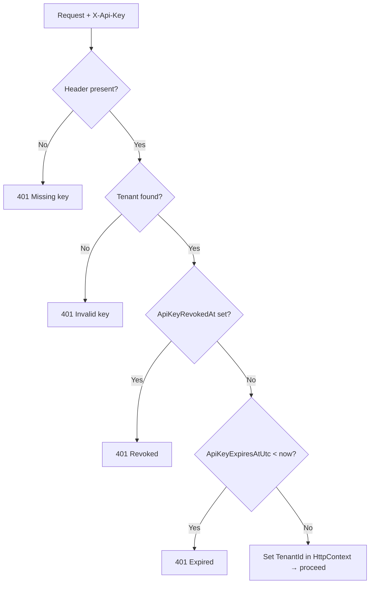
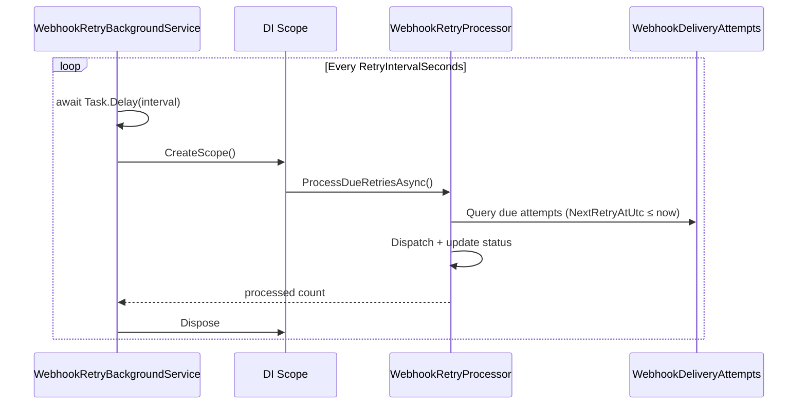

# Phase 9 Lesson: Production Backend Hardening

## Why This Phase Exists

Phases 0–8 made the system functionally correct: server-authoritative pricing, durable webhook delivery, tenant scoping. Phase 9 makes it operationally trustworthy: the delivery loop is fully proved end-to-end, API keys have a lifecycle, and the retry orchestration runs hands-free.

---

## Slice 1 — E2E Webhook Delivery Harness

### The Gap We Closed

Before this slice, the webhook delivery path had two separate unit test layers:

| Test | What it proves | What it skips |
|---|---|---|
| `QuoteCompletionWebhookDispatcherTests` | Dispatcher builds and POSTs correct payload | Controller not involved |
| `QuoteSessionsControllerTests` | Controller calls dispatcher and persists attempt | Fake dispatcher, no real HTTP |

No single test exercised all three together. A bug in how the controller wires the dispatcher, or how the dispatcher maps entity fields to the payload, could hide between those layers.

### What We Built

`WebhookE2EHarnessTests` in `WindowConfigurator.Tests/Webhooks/`:

- Wires the **real** `QuoteCompletionWebhookDispatcher` into the **real** `QuoteSessionsController`
- Uses `StubWebhookReceiver` — a custom `HttpMessageHandler` that intercepts the outbound HTTP call, captures the body, and returns a configured status code
- Asserts payload shape, delivery attempt persistence, and retry metadata on failure

### Build Steps

1. Create `WindowConfigurator.Tests/Webhooks/WebhookE2EHarnessTests.cs`
2. Set up the full real stack with SQLite in-memory (same pattern as other controller tests)
3. Define `StubWebhookReceiver : HttpMessageHandler` inside the test class
4. Define local `TestPayload` / `TestSession` / `TestOrderGroup` / `TestItem` DTOs for deserialization — decoupled from internal types
5. Write success-path test: stub returns 200, assert payload fields and `Delivered` attempt
6. Write failure-path test: stub returns 503, assert `Failed` attempt with `NextRetryAtUtc` set

### Delivery Loop Diagram



### Representative Snippet

```csharp
// StubWebhookReceiver intercepts the outbound HTTP call
private class StubWebhookReceiver : HttpMessageHandler
{
    private readonly HttpStatusCode _statusCode;
    private string _lastBody = string.Empty;
    public int CallCount { get; private set; }

    protected override async Task<HttpResponseMessage> SendAsync(
        HttpRequestMessage request, CancellationToken cancellationToken)
    {
        CallCount++;
        _lastBody = await request.Content!.ReadAsStringAsync(cancellationToken);
        return new HttpResponseMessage(_statusCode)
        {
            Content = new StringContent("{}", Encoding.UTF8, "application/json")
        };
    }

    public T? DeserializeLastBody<T>()
    {
        var options = new JsonSerializerOptions { PropertyNameCaseInsensitive = true };
        return JsonSerializer.Deserialize<T>(_lastBody, options);
    }
}

// Wired into the real controller — no fake dispatcher
var dispatcher = new QuoteCompletionWebhookDispatcher(new HttpClient(stub));
var controller = new QuoteSessionsController(
    _sessionRepository, _tenantRepository, new CatalogService(),
    dispatcher, _deliveryAttemptRepository);
```

### Why Local DTOs for Assertions

Deserializing the captured body into local `TestPayload` / `TestItem` DTOs (rather than reusing `QuoteCompletedPayload` directly) decouples the assertion from the internal type. If the payload class is refactored, the test catches it as a deserialization mismatch rather than silently passing.

### Tests Added

| Test | Asserts |
|---|---|
| `Complete_WithRealDispatcher_DeliversFullPayloadToStubReceiverAndPersistsAttempt` | Payload shape, attempt `Delivered`, stub call count |
| `Complete_WhenStubReceiverReturnsServerError_PersistsFailedAttemptWithRetryScheduled` | Attempt `Failed`, `NextRetryAtUtc` set, status code 503 |

### ADR

`adr/0012-e2e-webhook-delivery-test-harness.md`

---

## Slice 2 — API Key Rotation/Revocation Lifecycle

### The Gap We Closed

A tenant's API key had no lifecycle. Once issued, it was valid forever with no way to expire or revoke it short of a database edit. A compromised key could not be invalidated.

### What We Built

**Entity changes** — `TenantEntity` gains two nullable fields:
- `ApiKeyExpiresAtUtc` — rejects the key after this UTC timestamp
- `ApiKeyRevokedAt` — permanently rejects the key

**Filter enforcement** — `ApiKeyAuthorizeFilter` now checks revocation then expiry after finding the tenant. Rejection order: missing → invalid → revoked → expired → grant.

**New endpoints** — `TenantApiKeyController`:
- `POST /api/v1/tenants/{id}/api-key/rotate` — generates new key, clears lifecycle, optional expiry
- `DELETE /api/v1/tenants/{id}/api-key` — sets `ApiKeyRevokedAt` (idempotent)

### Build Steps

1. Add `ApiKeyExpiresAtUtc` and `ApiKeyRevokedAt` to `TenantEntity` (nullable `DateTime?`)
2. Red tests in `ApiKeyAuthorizeFilterTests`: revoked → 401, expired → 401, future expiry → proceeds
3. Update `ApiKeyAuthorizeFilter` to enforce both checks (green)
4. Red tests in `TenantApiKeyControllerTests`: rotate generates new key, expiry set, scope mismatch → 403
5. Add `RotateApiKeyRequest`, `RotateApiKeyResponse` DTOs
6. Implement `TenantApiKeyController` with rotate + revoke (green)

### Auth Filter Lifecycle Diagram



### Representative Snippet

```csharp
// TenantEntity
public DateTime? ApiKeyExpiresAtUtc { get; set; }
public DateTime? ApiKeyRevokedAt { get; set; }

// ApiKeyAuthorizeFilter — after tenant lookup
if (tenant.ApiKeyRevokedAt.HasValue)
    { context.Result = Unauthorized("API key has been revoked."); return; }
if (tenant.ApiKeyExpiresAtUtc.HasValue && tenant.ApiKeyExpiresAtUtc.Value < DateTime.UtcNow)
    { context.Result = Unauthorized("API key has expired."); return; }

// TenantApiKeyController — rotate
tenant.ApiKey = Guid.NewGuid().ToString("N");
tenant.ApiKeyRevokedAt = null;
tenant.ApiKeyExpiresAtUtc = request.ExpiresAtUtc;

// TenantApiKeyController — revoke (idempotent)
tenant.ApiKeyRevokedAt ??= DateTime.UtcNow;
```

### Tests Added

| Test | Asserts |
|---|---|
| `OnActionExecutionAsync_WithRevokedApiKey_ReturnsUnauthorized` | Revoked key → 401 |
| `OnActionExecutionAsync_WithExpiredApiKey_ReturnsUnauthorized` | Expired key → 401 |
| `OnActionExecutionAsync_WithKeyExpiringInFuture_Proceeds` | Future expiry → granted |
| `Rotate_WhenAuthenticated_GeneratesNewKeyAndReturnsIt` | New key returned, differs from old |
| `Rotate_WithExpiresAtUtc_SetsExpiryOnNewKey` | Expiry persisted |
| `Rotate_ClearsAnyPreviousRevocationOrExpiry` | Revocation/expiry cleared on rotate |
| `Revoke_WhenAuthenticated_SetsRevokedAtAndReturnsNoContent` | `ApiKeyRevokedAt` set, 204 |
| `Revoke_WhenTenantScopeMismatch_ReturnsForbidden` | Wrong tenant → 403 |

### ADR

`adr/0013-api-key-rotation-revocation-lifecycle.md`

---

## Slice 3 — Webhook Operations Hardening

### The Gap We Closed

The retry processor existed but only ran when triggered manually via `POST /api/v1/webhook-deliveries/retry-due`. In production, missed retries meant undelivered webhooks without any autonomous recovery.

### What We Built

**Background service** — `WebhookRetryBackgroundService : BackgroundService`:
- Registered as `IHostedService` in `Program.cs`
- Polls every `Webhooks:RetryIntervalSeconds` seconds (default 300)
- Creates a fresh DI scope per tick to resolve the scoped `IWebhookRetryProcessor`
- Handles cancellation cleanly

**Stats endpoint** — `GET /api/v1/webhook-deliveries/stats`:
- Returns `{ delivered, failed, total, asOfUtc }`
- Backed by `IWebhookDeliveryAttemptRepository.GetStatsAsync()`

### Build Steps

1. Red test: `WebhookRetryBackgroundServiceTests` — 0-second interval, cancel after 200ms, assert processor called ≥ 1
2. Add `GetStatsAsync()` to `IWebhookDeliveryAttemptRepository` and `EfWebhookDeliveryAttemptRepository`
3. Implement `WebhookRetryBackgroundService` using `IServiceScopeFactory` (green background test)
4. Red tests: `WebhookDeliveryStatsTests` — mixed attempts → correct counts, empty → zeros
5. Add `WebhookDeliveryStatsResponse` DTO
6. Update `WebhookDeliveriesController` to accept repo and add `GetStats` endpoint (green stats tests)
7. Register `AddHostedService<WebhookRetryBackgroundService>()` in `Program.cs`

### Retry Loop Diagram



### Representative Snippet

```csharp
// WebhookRetryBackgroundService
protected override async Task ExecuteAsync(CancellationToken stoppingToken)
{
    while (!stoppingToken.IsCancellationRequested)
    {
        await Task.Delay(_pollInterval, stoppingToken);
        if (stoppingToken.IsCancellationRequested) break;

        using var scope = _scopeFactory.CreateScope();
        var processor = scope.ServiceProvider.GetRequiredService<IWebhookRetryProcessor>();
        await processor.ProcessDueRetriesAsync(cancellationToken: stoppingToken);
    }
}

// Program.cs registration
builder.Services.AddHostedService<WebhookRetryBackgroundService>();
```

### Tests Added

| Test | Asserts |
|---|---|
| `ExecuteAsync_OnEachInterval_CallsRetryProcessor` | Processor called ≥ 1 in 200ms with 0-second interval |
| `GetStats_WithMixedAttempts_ReturnsCorrectCounts` | 2 delivered + 3 failed = correct breakdown |
| `GetStats_WithNoAttempts_ReturnsZeroCounts` | All zeros when table empty |

### ADR

`adr/0014-webhook-background-retry-orchestrator.md`

---

## What To Teach In A Video

- Why two passing unit tests can still leave an integration gap (Slice 1).
- Why a `HttpMessageHandler` stub is lighter than `TestServer` for E2E webhook testing.
- Why local assertion DTOs give more signal than reusing internal types.
- Why API keys need a lifecycle and why expiry is nullable by default (Slice 2).
- Why `BackgroundService` uses `IServiceScopeFactory` instead of direct scoped injection (Slice 3).
- The principle: test the seams, not just the parts.
