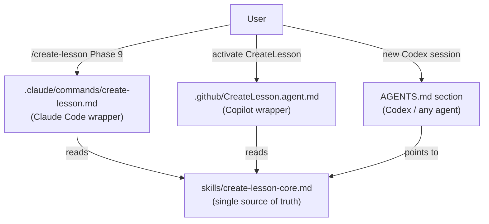

# Phase 9.5 Lesson: Creating Portable Agent Skills

## Why This Phase Exists

After ten phases of work, a pattern emerged: every time a new agent session started, the same instruction had to be re-explained — how to write a lesson. That is exactly the kind of repeated, bounded task a skill is designed to encode once and reuse everywhere.

This phase introduces the write-once, reference-everywhere skill pattern. It solves a real problem: Claude Code, GitHub Copilot, and OpenAI Codex each read skills from different locations using different formats. Maintaining three separate copies of the same instructions guarantees they drift. The solution is one canonical core file and three thin wrappers that point to it.

---

## The Portability Problem

No single file format works natively across all three agent runtimes.

| Runtime | Reads skills from | Format |
|---|---|---|
| Claude Code | `.claude/commands/<name>.md` (project) or `~/.claude/commands/` (global) | Markdown with YAML frontmatter |
| GitHub Copilot | `.github/<Name>.agent.md` | Markdown with YAML frontmatter (different schema) |
| OpenAI Codex | `AGENTS.md` in the repo root | Plain Markdown, no frontmatter |

If you put Claude Code frontmatter in the core file, Copilot silently misparsed it. If you write three separate files, they drift within weeks.

---

## The Write-Once, Reference-Everywhere Pattern

```
skills/
  create-lesson-core.md       ← single source of truth (runtime-agnostic)

.claude/commands/
  create-lesson.md            ← Claude Code wrapper: frontmatter + one pointer line

.github/
  CreateLesson.agent.md       ← Copilot wrapper: frontmatter + one pointer line

AGENTS.md                     ← Codex: a named section describing the skill
```

The core file contains all the real logic. Each wrapper is a thin adapter: runtime-specific frontmatter and one line that says "read the core."

When the instructions change, you update one file.

---

## Build Steps

### Step 1 — Write the Core File

Create `skills/create-lesson-core.md`. This file must be:

- Entirely runtime-agnostic (no `{{args}}`, no Copilot-specific frontmatter)
- Self-contained: readable as a plain chat prompt without any wrapper
- Structured with: Purpose, When To Invoke, What To Read First, Required Structure, Rules, Acceptance Checks

### Step 2 — Write the Claude Code Wrapper

Create `.claude/commands/create-lesson.md` at the workspace root (where Claude Code is invoked from):

```markdown
---
name: create-lesson
description: Creates a structured lesson document from recently completed phase, slice, or step work. Produces a lessons/ markdown file with build steps, Mermaid diagram, code snippets, and test table in the project's standard format.
argument-hint: <phase or step name, e.g. "Phase 9 Slice 2">
---

Read `WindowConfigurator/skills/create-lesson-core.md` for the full instruction set.

Apply those instructions to produce a lesson for the following work: {{args}}
```

The `description` field is load-bearing — Claude Code uses it to match user intent to the right skill. Write it as an intent description, not a title.

### Step 3 — Write the Copilot Wrapper

Create `.github/CreateLesson.agent.md` inside the project directory:

```markdown
---
name: CreateLesson
description: Creates a structured lesson document from recently completed phase, slice, or step work
tools: ['read', 'write', 'edit']
---

Read `skills/create-lesson-core.md` for the full instruction set, then apply those instructions to produce a lesson for the work described in the user's request.
```

### Step 4 — Add the Codex Section to AGENTS.md

Codex reads `AGENTS.md` at session start. Add a named section describing the skill and how to invoke it. Include the path to the core file so any agent can find and read it:

```markdown
## Available Skills

### create-lesson

**Purpose:** Produces a structured lesson document from completed phase, slice, or step work.
**When to invoke:** After completing any phase, slice, or step where new files were created, tests were written, and at least one design decision was made.
**Core instructions:** `skills/create-lesson-core.md`
```

### Step 5 — Add the Hard Stop to `.claude/settings.json`

The behavioral rule in AGENTS.md is the primary constraint. The settings file adds an enforcement layer for Claude Code specifically:

```json
{
  "permissions": {
    "deny": [
      "Read(d:/Repos/agent-orchestration/**)",
      "Write(d:/Repos/agent-orchestration/**)",
      "Edit(d:/Repos/agent-orchestration/**)"
    ]
  }
}
```

Place this at `<workspace-root>/.claude/settings.json`. Add deny entries for any path outside the workspace that should never be touched. Note: `settings.local.json` (already present) is for user-local allow rules like approved Bash commands; `settings.json` is the committed project-wide policy.

---

## File Structure Diagram



---

## Representative Snippet — The Thin Wrapper

```markdown
---
name: create-lesson
description: Creates a structured lesson document from recently completed phase, slice, or step work. Produces a lessons/ markdown file with build steps, Mermaid diagram, code snippets, and test table in the project's standard format.
argument-hint: <phase or step name, e.g. "Phase 9 Slice 2">
---

Read `WindowConfigurator/skills/create-lesson-core.md` for the full instruction set.

Apply those instructions to produce a lesson for the following work: {{args}}
```

The entire wrapper is four lines after the frontmatter. All the intelligence lives in the core. The wrapper's only job is to tell Claude Code how to find it and what to pass in.

---

## How To Copy This To A New Project

1. Copy `skills/` into the new project root
2. Copy `.github/CreateLesson.agent.md` into the new project root
3. Create `.claude/commands/create-lesson.md` at the workspace root — update the path to the core file if your project structure differs
4. Add the `## Available Skills` section to the new project's `AGENTS.md`
5. Add a `deny` entry to `.claude/settings.json` for any paths outside the new workspace that should never be read

---

## What To Teach In A Video

- Why three copies of the same instructions is an anti-pattern — they will drift, and the agent will follow whichever copy it finds first
- Why the `description` field in Claude Code wrappers is load-bearing, not decorative — it is used to match user intent, so vague descriptions degrade trigger accuracy
- Why the core file must be runtime-agnostic — if it contains `{{args}}` or Copilot frontmatter, it cannot be read as a plain chat prompt and loses portability
- The two enforcement layers: AGENTS.md (behavioral, cross-tool) vs. settings.json (hard stop, Claude Code only)
- The difference between `settings.json` (committed project policy) and `settings.local.json` (user-local allow rules) — both live in `.claude/` but serve different roles
