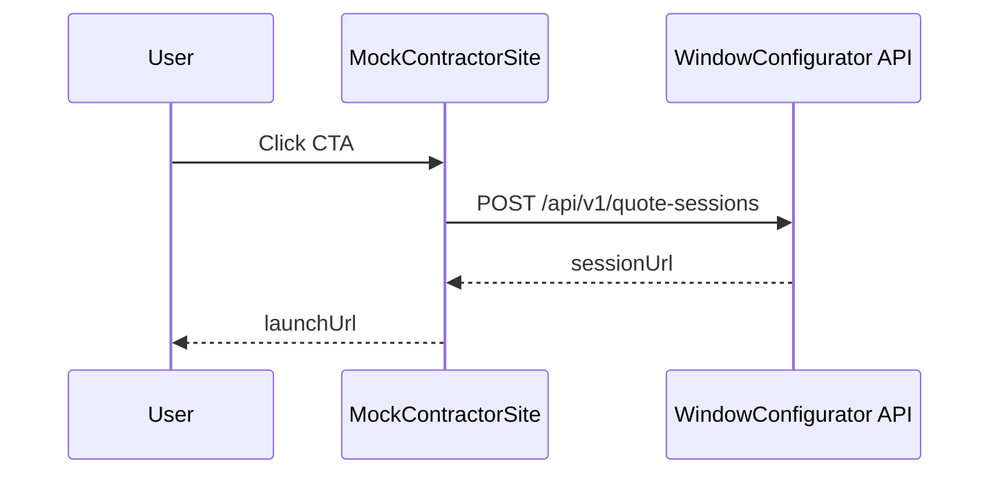
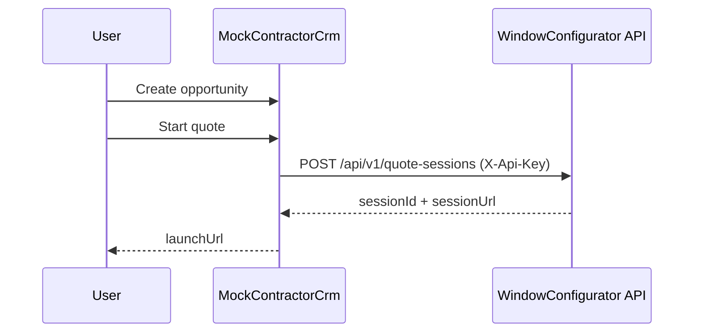

# Phase 10 Lesson: Customer-Facing Demo Slices

## Why This Phase Exists

Phases 0–9.5 established backend authority, but demo delivery still needed stable customer-facing entry points and CRM-like orchestration that do not depend on external platform availability.

## Slice A: Contractor Landing Shell

**The Gap We Closed**

No standalone host-site surface existed to start authenticated quote sessions and load the configurator in context.

**What We Built**

- `MockContractorSite/MockContractorSite.csproj`
- `MockContractorSite/Program.cs`
- `MockContractorSite/Services/MockContractorOptions.cs`
- `MockContractorSite/Services/QuoteSessionBootstrapClient.cs`
- `MockContractorSite/wwwroot/index.html`
- `MockContractorSite/wwwroot/site.js`
- `WindowConfigurator.Tests/Services/QuoteSessionBootstrapClientTests.cs`

**Build Steps**

1. Add failing test for API-key header + launch URL behavior.
2. Implement session bootstrap client.
3. Add host endpoint and CTA-driven iframe launch UI.

**Slice A Diagram**



**Representative Snippet**

```csharp
request.Headers.Add("X-Api-Key", _options.ApiKey);
request.Content = JsonContent.Create(new
{
    tenantId = _options.TenantId,
    defaultProductLineKey = _options.DefaultProductLineKey
});
```

**Tests Added**

| Test | Asserts |
|---|---|
| `CreateSessionLaunchAsync_UsesConfiguredApiKeyAndReturnsAbsoluteLaunchUrl` | API-key auth, endpoint target, and relative-to-absolute launch URL mapping |

## Slice B: Mock CRM Portal Kickoff

**The Gap We Closed**

No CRM-like operator surface existed to create opportunities and start quote sessions with API-authenticated behavior matching real CRM callers.

**What We Built**

- `MockContractorCrm/MockContractorCrm.csproj`
- `MockContractorCrm/Program.cs`
- `MockContractorCrm/Services/MockCrmOptions.cs`
- `MockContractorCrm/Services/CrmQuoteSessionClient.cs`
- `MockContractorCrm/Services/CrmOpportunityStore.cs`
- `MockContractorCrm/wwwroot/index.html`
- `MockContractorCrm/wwwroot/site.js`
- `WindowConfigurator.Tests/Services/CrmQuoteSessionClientTests.cs`

**Build Steps**

1. Add failing test for CRM quote-session client auth + URL behavior.
2. Implement authenticated `CrmQuoteSessionClient`.
3. Add minimal in-memory opportunity endpoints and UI.

**Slice B Diagram**



**Representative Snippet**

```csharp
request.Headers.Add("X-Api-Key", _options.ApiKey);
request.Content = JsonContent.Create(new
{
    tenantId = _options.TenantId,
    externalReferenceId = opportunityNumber,
    customerEmail
});
```

**Tests Added**

| Test | Asserts |
|---|---|
| `StartQuoteSessionAsync_UsesApiKeyAuthAndReturnsAbsoluteLaunchUrl` | API-key auth, quote-session endpoint target, and resolved absolute launch URL |

## What To Teach In A Video

- Why host/demo shells should call authoritative APIs server-side.
- How to keep CRM simulation realistic without vendor lock-in.
- Why mock CRM + mock website improve demo reliability while preserving integration truth.
