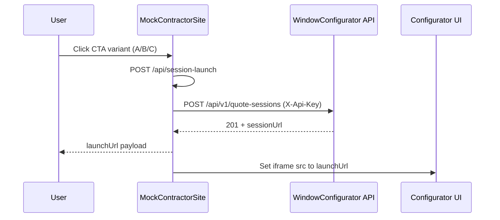
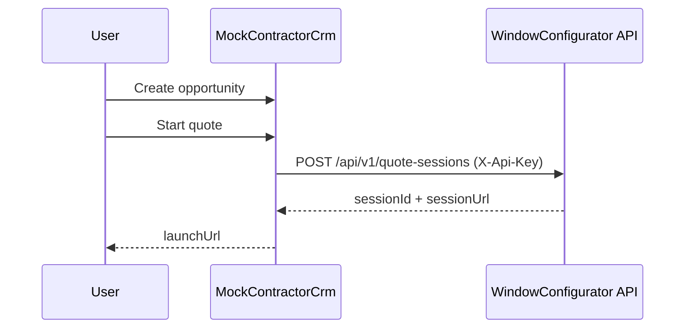

# Phase 10 Lesson: Customer-Facing Demo Slices

## Why This Phase Exists

Phases 0–9.5 made the backend authoritative, but demo reliability was still coupled to external CRM behavior and ad hoc entry paths. Phase 10 reduces presentation and adoption risk by adding deterministic customer-facing surfaces (mock contractor site + mock CRM) that exercise the same authoritative APIs without depending on live CRM platform responsiveness.

## Slice A: Contractor Landing Shell

**The Gap We Closed**

Before this slice, there was no standalone contractor-host demo entry point that could start authenticated quote sessions and embed the configurator in-page.

**What We Built**

- `MockContractorSite/MockContractorSite.csproj` — separate web app for host-site demo flow.
- `MockContractorSite/Program.cs` — static-file hosting plus `POST /api/session-launch`.
- `MockContractorSite/Services/MockContractorOptions.cs` — config contract for base URL, tenant, API key, product line.
- `MockContractorSite/Services/QuoteSessionBootstrapClient.cs` — server-side client for API-key-authenticated `POST /api/v1/quote-sessions`.
- `MockContractorSite/wwwroot/index.html` — landing page with fixed CTA variants A/B/C and iframe container.
- `MockContractorSite/wwwroot/site.js` — CTA click handler and iframe launch behavior.
- `WindowConfigurator.Tests/Services/QuoteSessionBootstrapClientTests.cs` — request/auth/launch URL regression coverage.
- `.vscode/launch.json` and `.vscode/tasks.json` in both workspace roots (`renonerd` and `WindowConfigurator`) — dual-site debug profiles and startup reliability tasks.

**Build Steps**

1. Write failing test (`QuoteSessionBootstrapClientTests`) asserting:
   - `X-Api-Key` is sent
   - create-session endpoint URL is correct
   - returned relative `sessionUrl` becomes absolute launch URL
2. Implement `QuoteSessionBootstrapClient` and options model to satisfy test.
3. Wire `MockContractorSite` endpoint and static page to call bootstrap client and set iframe source.

**Slice A Launch Flow Diagram**



**Representative Snippet**

```csharp
using var request = new HttpRequestMessage(HttpMethod.Post, requestUrl);
request.Headers.Add("X-Api-Key", _options.ApiKey);
request.Content = JsonContent.Create(new
{
    tenantId = _options.TenantId,
    defaultProductLineKey = _options.DefaultProductLineKey,
    externalReferenceId = $"mock-site-{ctaVariant}-{DateTime.UtcNow:yyyyMMddHHmmss}"
});
```

This keeps the mock host behavior protocol-accurate to a real CRM caller while remaining platform-agnostic.

**Tests Added**

| Test | Asserts |
|---|---|
| `CreateSessionLaunchAsync_UsesConfiguredApiKeyAndReturnsAbsoluteLaunchUrl` | API-key header, create-session target URL, and relative-to-absolute launch URL transformation |

**Debug Runtime Notes**

- VS Code `serverReadyAction.uriFormat` must include exactly one `%s` placeholder; fixed to `%s/00000000-0000-0000-0000-000000000001`.
- Workspace had two `.vscode` roots (`renonerd/.vscode` and `WindowConfigurator/.vscode`); both were aligned so launch options are consistent regardless of which folder is opened in VS Code.
- Added temporary `reset-dev-db-windowconfigurator-temporary` prelaunch task to avoid stale SQLite schema crashes during branch iteration.

## Slice B: Mock CRM Portal Kickoff

**The Gap We Closed**

No CRM-like operator surface existed to create opportunities and start quote sessions with API-authenticated behavior matching real CRM callers.

**What We Built**

- `MockContractorCrm/MockContractorCrm.csproj`
- `MockContractorCrm/Program.cs`
- `MockContractorCrm/Services/MockCrmOptions.cs`
- `MockContractorCrm/Services/CrmQuoteSessionClient.cs`
- `MockContractorCrm/Services/CrmOpportunityStore.cs`
- `MockContractorCrm/wwwroot/index.html`
- `MockContractorCrm/wwwroot/site.js`
- `WindowConfigurator.Tests/Services/CrmQuoteSessionClientTests.cs`

**Build Steps**

1. Add failing test for CRM quote-session client auth + URL behavior.
2. Implement authenticated `CrmQuoteSessionClient`.
3. Add minimal in-memory opportunity endpoints and UI.

**Slice B Diagram**



**Representative Snippet**

```csharp
request.Headers.Add("X-Api-Key", _options.ApiKey);
request.Content = JsonContent.Create(new
{
    tenantId = _options.TenantId,
    externalReferenceId = opportunityNumber,
    customerEmail
});
```

**Tests Added**

| Test | Asserts |
|---|---|
| `StartQuoteSessionAsync_UsesApiKeyAuthAndReturnsAbsoluteLaunchUrl` | API-key auth, quote-session endpoint target, and resolved absolute launch URL |

## What To Teach In A Video

- Why host/demo shells should call authoritative APIs server-side rather than from browser JS.
- How fixed CTA variants allow controlled copy experiments before analytics instrumentation.
- Why iframe-first launch reduces context switching in demos.
- How to keep CRM simulation realistic without coupling to a real CRM vendor runtime.
- Why mock CRM + mock website improve demo reliability while preserving integration truth.
