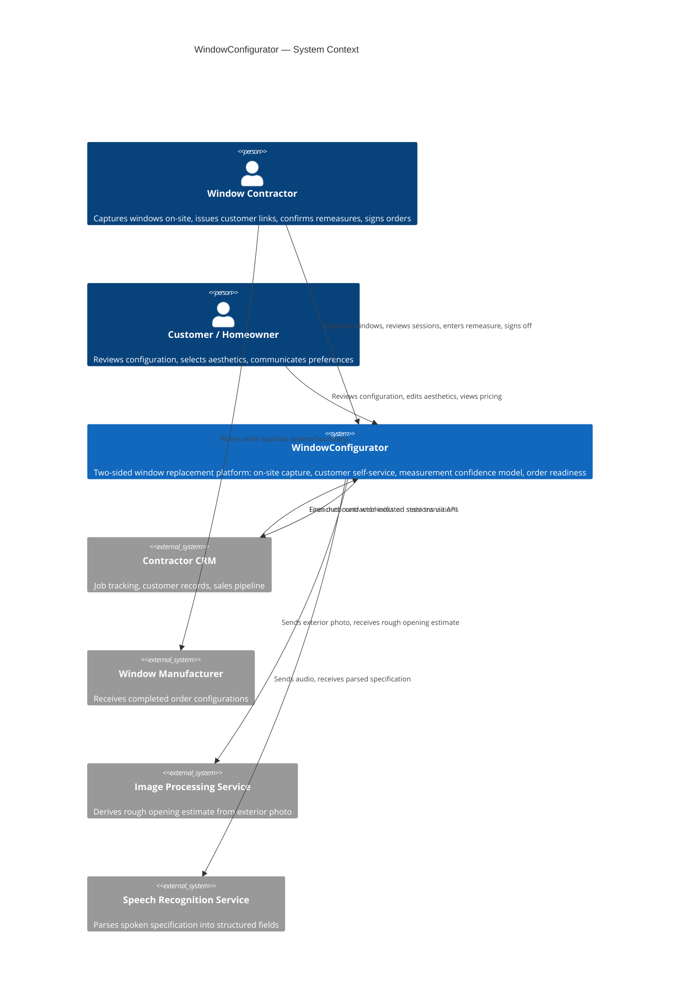
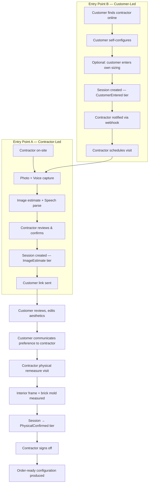
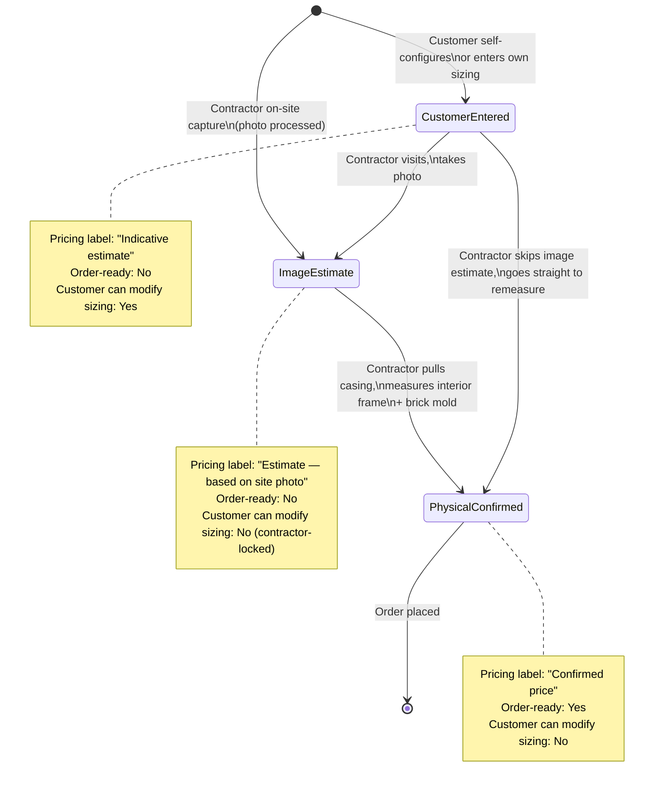
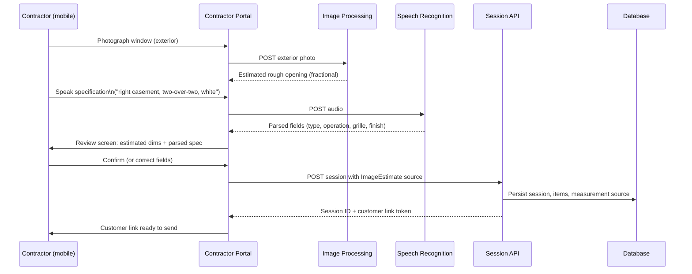

# System Architecture Diagrams — WindowConfigurator

*Pre-Phase A artifact · Version 1.0 · 2026-06-12*

---

## 1. System Context

WindowConfigurator sits between contractors and their customers. It does not call CRMs; it receives calls from them and fires events back.



---

## 2. Two Entry Points — Flow Comparison



---

## 3. Measurement Confidence State Machine



---

## 4. Component Architecture

Extends ADRs 0001–0018. New components introduced by the evolved product direction are marked **[NEW]**.

```mermaid
flowchart TB
    subgraph Client["Client — Blazor WebAssembly [NEW: Blazor]"]
        CP[Contractor Portal\nMobile-first capture UI]
        CS[Customer Session\nAesthetics + live pricing]
        PE[Pricing Engine\nC# running in-browser]
    end

    subgraph Server["Server — ASP.NET Core"]
        API[Session API\nPOST/GET/PUT sessions]
        PS[Pricing Service\nAuthoritative calculation]
        VS[Validation Service\nCompletion rules]
        CR[Catalog Resolver\nProduct line + assets]
        WD[Webhook Dispatcher\nOutbound events + retry]
        RM[Remeasure Controller\n[NEW] Physical measure entry]
        SL[Session Link Generator\n[NEW] Signed token URLs]
    end

    subgraph Pipelines["AI Pipelines [NEW]"]
        IP[Image Processing\nExterior photo → rough opening estimate]
        SR[Speech Recognition\nAudio → specification fields]
    end

    subgraph Data["Data"]
        DB[(SQL Database\nSessions, items, tenants,\nmeasurement source)]
        PG[(Pricing Grid\nSerialized at session open)]
    end

    subgraph External["External"]
        CRM[Contractor CRM]
        MFG[Manufacturer]
    end

    CP --> IP
    CP --> SR
    IP --> API
    SR --> API
    CS --> PE
    PE --> PG
    API --> PS
    API --> VS
    API --> CR
    API --> WD
    API --> RM
    API --> SL
    PS --> DB
    CR --> DB
    WD --> CRM
    RM --> DB
    SL --> CS
```

---

## 5. On-Site Capture Sequence



---

## 6. Architectural Decisions Inherited

The following ADRs govern the backend contract and remain in force for the evolved system:

| ADR | Decision | Still applies |
|---|---|---|
| 0001 | Unidirectional webhook integration — no CRM API calls | Yes — non-negotiable |
| 0002 | Two-flow architecture (CRM-launched, website-launched) | Yes — extended to contractor-led / customer-led |
| 0003 | Session-centric domain model | Yes |
| 0004 | Product line as session input | Yes |
| 0005 | Completion payload contract | Yes |
| 0006 | Runtime pricing grid alignment | Yes — grid now also preloaded to client |
| 0007 | Minimal versioned session API surface | Yes |
| 0008–0009 | Webhook dispatch and durable delivery tracking | Yes |
| 0010–0014 | Multi-tenant hardening, API key, retry, E2E harness | Yes |
| 0015–0018 | Mock demo host architecture, iframe, postMessage, CRM polling | Yes — demo surfaces remain |

**New architectural decisions required (to be written as ADRs when implementation begins):**
- ADR-NEW-A: Image processing service selection and integration pattern
- ADR-NEW-B: Speech recognition service selection and integration pattern
- ADR-NEW-C: Blazor WebAssembly adoption — migration strategy from Knockout.js
- ADR-NEW-D: Pricing grid serialization format for client-side preload
- ADR-NEW-E: Measurement source state machine and transition rules
- ADR-NEW-F: Session link token format, signing, and expiry
