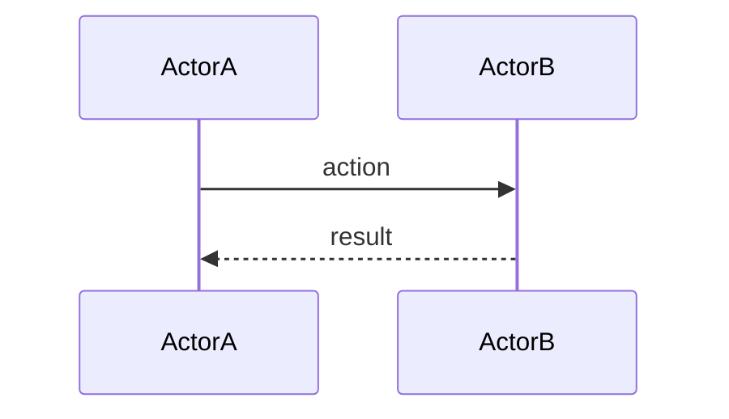
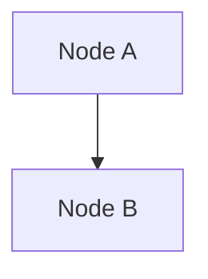

# Skill: create-lesson (Core Instructions)

This file is the single source of truth for the `create-lesson` skill. Runtime-specific wrappers (Claude Code, Copilot) reference this file. Do not embed runtime-specific syntax here.

---

## Purpose

Produce a structured lesson document from recently completed work — a phase, a slice, a step, an experiment, or a planning/framework-adoption session. The lesson captures what happened, why, and what was learned, in a format usable as a teaching reference, onboarding material, or portfolio evidence.

---

## When To Invoke

After any phase, slice, step, or session where:
- New files were created or significantly changed
- At least one non-trivial design decision was made
- Tests were written (implementation lessons) OR a significant framework/approach was adopted (planning lessons)

---

## What To Read First

Before writing anything, read the following in order:

1. The most recent journal entry (or the journal entry matching the phase/step name provided)
2. Each new or changed source file mentioned in that journal entry
3. The test file(s) for the new code (for implementation lessons)
4. The ADR(s) written for this work, if any
5. `lessons/LESSON_CATALOG.md` — to confirm the file does not already exist for this topic

Do not invent code snippets. Every snippet in the lesson must come from actual source files you read.

---

## File Naming

```
lessons/YYYY-MM-DD_kebab-topic.md
```

Examples:
- `lessons/2026-06-11_agile-v-experiment-design.md`
- `lessons/2026-07-01_slice-d-requirements-first.md`

If a lesson file for this topic already exists, update it rather than creating a duplicate.

---

## Format

Every lesson uses numbered prose chapters. See `lessons/LESSON_TEMPLATE.md` for the skeleton and `lessons/lesson_2026-06-11_agile-v-experiment-design.md` for a worked planning-session example.

### Title and dateline

```
# Lesson: [Descriptive Topic Title]

*YYYY-MM-DD — one-line summary of what this lesson covers*
```

### Content chapters

Numbered chapters with descriptive titles. The number and titles are up to you — adapt them to the material.

**Rule: prose only in content chapters.** No bullet lists, no numbered lists inside chapters. Code blocks and tables are welcome.

Each chapter's opening sentence should name the *why* before the *what*. Chapter titles should name the concept being explained, not a generic ordinal ("Why requirements come first" not "Chapter 3").

For implementation lessons, the content chapters typically cover:
- Why this phase/slice exists (gap closed, risk reduced)
- The design decision made and the alternatives considered
- The TDD sequence (red → green → wire)
- Key code patterns introduced
- ADR written

For planning/experiment lessons, the content chapters typically cover:
- The problem or opportunity that triggered the decision
- The framework or approach adopted
- The design of the experiment or measurement system
- What the first step looks like in practice
- Cost/tradeoff considerations

### "What We Learned" chapter

The last numbered chapter. **This is the only chapter that uses bullet points.**

- Each bullet is one complete sentence.
- Focus on transferable insight. "X is true" is weaker than "X matters because Y."
- Aim for 5–10 bullets.

### "What Comes Next"

After the final numbered chapter. Numbered list of concrete, immediate next steps only.

### Research References (when applicable)

Optional section. Include when papers, frameworks, or external sources informed decisions in the lesson.

Citation style:
```
Author, A. (YYYY). Title. *Venue*. One sentence on relevance.
```

### Mermaid diagrams

**Both diagrams are required in every lesson.** Place them at the end of the file, after Research References.

**Sequence Interaction Diagram:** models runtime or process flow — who calls what, in what order. Use participant names that match real names in the code or process. These are the most valuable diagram type for multi-step or multi-agent flows.



**Concept Diagram:** models structural relationships between concepts, files, components, or decisions.



---

## Implementation Lesson — Additional Elements

For implementation lessons (slices, phases, TDD work), add these elements inside the relevant content chapters:

**Build steps** (inside the implementation chapter):
1. Write the failing test (red)
2. Implement minimum code to pass (green)
3. Wire up (DI registration, migration, etc.)

**Representative snippet** — one code block, actual code from source files. Add one line of comment explaining *why* this approach was chosen (not what it does).

**Tests table** (inside or after the implementation chapter):

| Test | Asserts |
|---|---|
| `TestMethodName` | What behavior it proves |

**ADR reference** — if an ADR was written, call it out: `` `adr/XXXX-name.md` ``

---

## After Writing the Lesson

1. Add an entry to `lessons/LESSON_CATALOG.md`:
   - Linked filename
   - Date
   - Topic (one line)
   - "Recorded result" if there is a measured or validated outcome

2. Quick consistency check: does the lesson match what is in the journal, ADRs, and roadmap for the same day/phase? Correct any drift before committing.

---

## Rules

- Do not read or reference files outside `D:\Repos\renonerd\`
- Do not invent code snippets — every snippet must be read from an actual source file
- Do not skip either Mermaid diagram
- Do not create a new lesson file if one already exists for this topic — update the existing one
- Do not add commentary about the lesson-writing process inside the lesson itself
- Prose in content chapters. Bullets only in "What We Learned"

---

## Acceptance Checks

- Does each chapter title name the concept, not just a number?
- Is every code snippet present verbatim in a source file in the repo?
- Are both Mermaid diagrams present?
- Does `lessons/LESSON_CATALOG.md` have an entry pointing to this file?
- Does "What We Learned" use bullets and no other chapter does?
